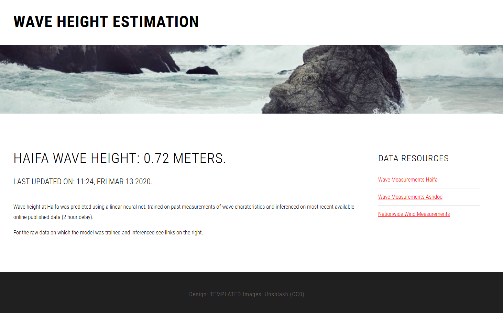

# Wave Height Estimation

## Introduction

Sailors, fishermen, surfers and all people of the sea heavily rely on accurate reports regarding the ocean's behaviour. Two of the major characteristics are wave height and wind speed. Israel has several real-time measurement facilities, which also provide automatic online posting of the data, being either governmental or standalone stations. However the drawback with their publications is that the values are updated to the web at an approximate of 2 hours of delay. Such delay is detrimental to those who need to know the current conditions, being surfers waking up at 5am to go surfing or sailors planning to set sail in the next half hour. Therefore forcing them to settle for less than perfect forecasts or rough estimates.

## Solution

This project involves a backend written in node.js that scrapes and stores data from Israel's Port Authority (wave measurements) and Israels' 
Meteorological Service (wind measurements), updated every 30 minutes. A linear neural net designed and implemented with Tensorflow.js is trained
every 12 hours, on the entire data collected. A dynamic frontend then displays a predict value of the wave height,
update with every half-hour data collection. All within a stylish designed webpage, imported from a pre-built template (see acknowledgments).
 
 
## Launch
 The node.js backend is served with an express.js framework, launched on a local machine we get:
 
 
  
 
## Future improvements
 1. While the data acquisition involves wind and wave data from four different stations, currently only one of them is being applying in the model (measurements from Haifa's port). An addition would be to combine all the sources into an aggregated input, thus improved the predictions.
 
 2. The neural model is a linear based fully-connected model, and since we are dealing here with time-series based information, a better approach would be to use a recurrent net, either GRU or LSTM. However, since the data is scarce at the moment, beneficial results will be seen only once we will reach a higher magnitude of stored data.
 
 
### Acknowledgements and Disclaimer
 * Data scraped from the aforementioned websites is copyrighted and belongs to its original institutions, all the use-cases in this project are for research and non-commercial purposes.
  
 * The HTML-CSS template was obtained from https://templated.co/, under a Creative-Commons license.
